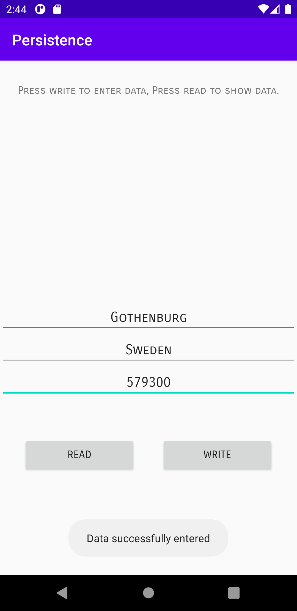

# Rapport

**1. Widgets bestående av en TextView, tre EditText och två Button skapades.**


**2. Skapade en databas med DatabaseTables**

Tabellen LOCATION tillsammans med önskade kolumner skapades. City angavs som primärnyckel för att inte
kunna dupliceras. CITY och COUNTRY angavs som text medan population som int vilken står för integer, siffor.

```
static class Location {

        static final String TABLE_NAME = "LOCATION";
        static final String COLUMN_NAME_CITY = "city";
        static final String COLUMN_NAME_COUNTRY = "country";
        static final String COLUMN_NAME_POPULATION = "population";
    }

    static final String SQL_CREATE_TABLE_LOCATION =
            // "CREATE TABLE location (city TEXT PRIMARY KEY, country TEXT, population INT)"
            "CREATE TABLE " + Location.TABLE_NAME + " (" +
                    Location.COLUMN_NAME_CITY + " TEXT PRIMARY KEY," +
                    Location.COLUMN_NAME_COUNTRY + " TEXT," +
                    Location.COLUMN_NAME_POPULATION + " INT)";

    static final String SQL_DELETE_TABLE_LOCATION =
            // "DROP TABLE IF EXISTS location"
            "DROP TABLE IF EXISTS " + Location.TABLE_NAME;
}
```


**3. Utförde koppling med hjälp av DatabaseHelper.**

För att kunna använda SQL databasen behövdes en hjälpklass som byggde på SQLiteOpenHelper.
Klassen specificerades genom arv/extend. Filen döptes till Location.db.
Inuti klassen skapades tabellen respektive raderades om versionen skulle förändras.
```
public class DatabaseHelper extends SQLiteOpenHelper {

    private static final int DATABASE_VERSION = 1; // If this is incremented onUpgrade() will be executed
    private static final String DATABASE_NAME = "Location.db"; // The file name of our database

    DatabaseHelper(Context context) {
        super(context, DATABASE_NAME, null, DATABASE_VERSION);
    }

    // This method is executed only if there is not already a database in the file `Location.db`
    @Override
    public void onCreate(SQLiteDatabase sqLiteDatabase) {
        sqLiteDatabase.execSQL(DatabaseTables.SQL_CREATE_TABLE_LOCATION);
    }

    // This method is executed only if the database version has changed, e.g. from 1 to 2
    @Override
    public void onUpgrade(SQLiteDatabase sqLiteDatabase, int oldVersion, int newVersion) {
        sqLiteDatabase.execSQL(DatabaseTables.SQL_DELETE_TABLE_LOCATION);
        onCreate(sqLiteDatabase);
    }

}
```

Därefter refererades och kopplades databasen och hjälpklassen i MainActivity genom att deklarera medlemsvariablerna:
```
    private SQLiteDatabase database;
    private DatabaseHelper databaseHelper;
```
Dessa initialiserades därefter inuti onCreate med hjälp av:
```
// Initialization of database and database helper class
     databaseHelper = new DatabaseHelper(this);
     database = databaseHelper.getWritableDatabase();
```


**4. Data tillades i databasen**

Värdena ifrån metoden addLocation bands ihop med värdena i klassen Location vilka
tillade data in i databasen.
Denna addLocation funktion lagrade de inskickade värdena i databasen:

```
    private long addLocation (String city, String country, int population) {
        ContentValues values = new ContentValues();
        values.put(DatabaseTables.Location.COLUMN_NAME_CITY, String.valueOf(city));
        values.put(DatabaseTables.Location.COLUMN_NAME_COUNTRY, String.valueOf(country));
        values.put(DatabaseTables.Location.COLUMN_NAME_POPULATION, String.valueOf(population));
        return database.insert(DatabaseTables.Location.TABLE_NAME, null, values);
    }
```

Inuti onCreate initialiserades EditTexterna samt TextViewn.  Dessa användes tillsammans med den
skapade 'write'-knappen. Vid klickning av Write-knappen lades de skapade strängarna inuti
addLocation funktionen.

```
        final EditText editCity, editCountry, editPopulation;
        editCity = findViewById(R.id.edit_text1);
        editCountry = findViewById(R.id.edit_text2);
        editPopulation = findViewById(R.id.edit_text3);
        final TextView textView = findViewById(R.id.text1_view);

        // Click values into database
        Button write = findViewById(R.id.write);
        write.setOnClickListener(new View.OnClickListener() {
            @Override
            public void onClick(View v) {
                String city = editCity.getText().toString();
                String country = editCountry.getText().toString();
                int population = Integer.parseInt(editPopulation.getText().toString());
                addLocation(city, country, population);
                Log.d("ENTERED ==>", "Data successfully entered!");
                Toast.makeText(MainActivity.this, "Data successfully entered", Toast.LENGTH_LONG).show();
            }
        });
```

Denna data skickades vidare till strängen toString vilken skulle förmedla och uppvisa datan vid nästa steg.

```
    @Override
    public String toString() { return city + ", " + country + ", " + population;}
```



_Bild 1: Demonstrerar ett toastmeddelande då data har lyckats insättas i databasen._


**5. All data hämtades från databasen**

En lista med Location gav tillbaka svaret från databasen. Nästa rad agerade som en select * from tabellen.
Cursorn vid 'move to next' förmedlar att nästa rad skall uppvisas tills det inte finns data kvar att iterera igenom
och listan kan då returnera datan.
cursor under 'cursor.movetonext' hänvisar till kolumnerna med dess datatyp och den insatta datan samt som gett svar

```
      private List<Location> getLocations() {
          Cursor cursor = database.query(DatabaseTables.Location.TABLE_NAME,
                  null,
                  null,
                  null,
                  null,
                  null,
                  null);
          List<Location> locations = new ArrayList<>();
          while (cursor.moveToNext()) {
              Location location = new Location(
                      cursor.getString(cursor.getColumnIndexOrThrow(DatabaseTables.Location.COLUMN_NAME_CITY)),
                      cursor.getString(cursor.getColumnIndexOrThrow(DatabaseTables.Location.COLUMN_NAME_COUNTRY)),
                      cursor.getInt(cursor.getColumnIndexOrThrow(DatabaseTables.Location.COLUMN_NAME_POPULATION))
              );
              locations.add(location);
          }
          cursor.close();
          return locations;
      }
```

En constructor skapades för att förbereda konstruktorn vid möte av angivna datatyper(se nedan)
för att förmedla hur objekten skulle skapas. Denna följde samma kolumnordning, och nu kunde objekten skapas.

```
    public Location(String _city, String _country, int _population) {
        city = _city;
        country = _country;
        population = _population;
    }
```

      Vid klick av knappen read så skapades den temporära listan locations med alla Location från metoden getLocation.
      Därefter itererades liststorleken. Alla locations på position [i] d.v.s. att alla existerande locations hämtades
      till metoden toString i Location-klassen som uppvisade datan i den skapta textviewn i steg 1.
      När datan lyckats uppvisas möttes användaren av en toast som intygade detta.

```
              Button read = findViewById(R.id.read);
              read.setOnClickListener(new View.OnClickListener() {
                  @Override
                  public void onClick(View v) {
                      String visible = "";
                      List<Location> locations = getLocations();
                      for (int i = 0; i < locations.size(); i++) {

                          visible += locations.get(i).toString() + "\n";
                          Log.d("READ ==>", "Sucessfully read data.");
                      }
                      textView.setText(visible);
                      Toast.makeText(MainActivity.this, "Data successfully read", Toast.LENGTH_LONG).show();
                      return;
                  }
              });
```


_Bild 2: Uppvisar uppvisandet av den insatta data från databasen._
